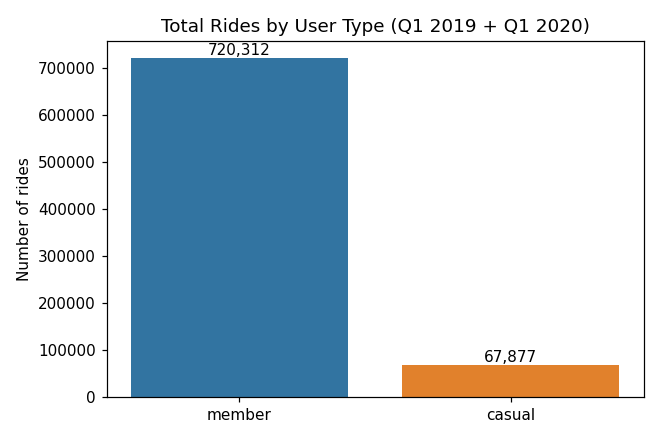
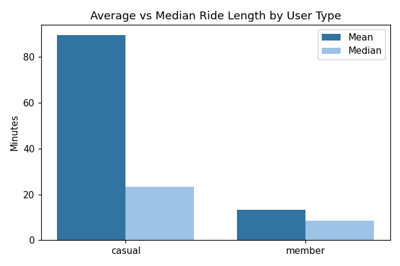
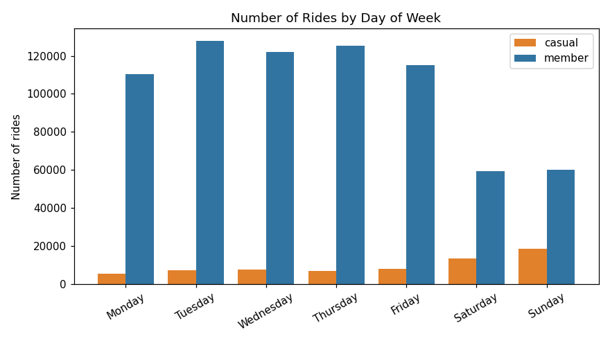
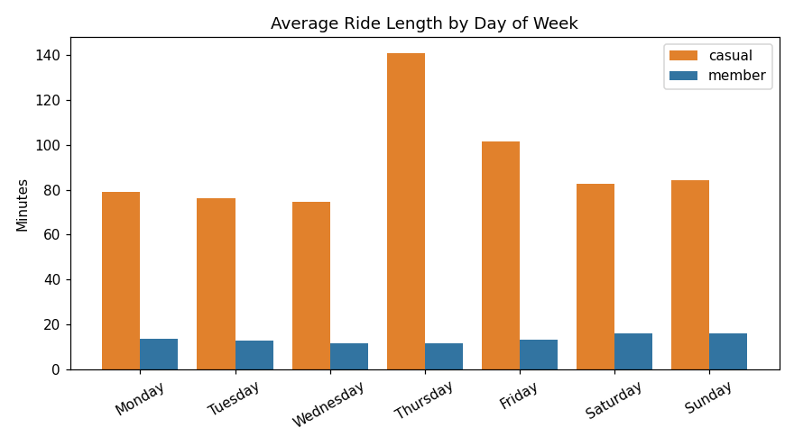
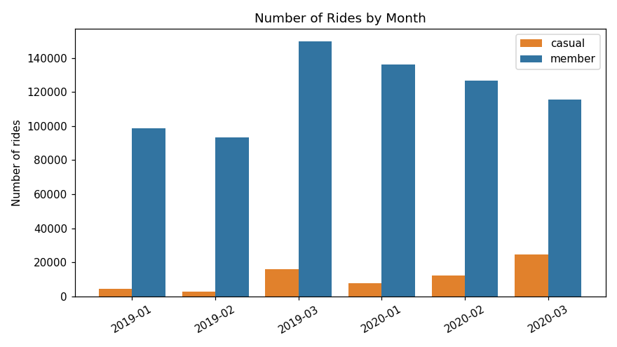

# Cyclistic Bike-Share Case Study — Final Report

**Analyst:** Elyas
**Question:** How do annual members and casual riders use Cyclistic bikes differently?
**Tool used:** Power BI Desktop (cleaning, transformation, and all visuals)
**Data:** Divvy trips, Q1 2019 + Q1 2020

---

## 1. Business task

Cyclistic makes more money from **annual members** than from **casual riders**
(single-ride and day-pass users). The marketing director, Lily Moreno, wants to grow the
business by converting existing casual riders into members — not by chasing brand-new
customers.

Before we can design that campaign, we need to understand one thing clearly:

> **In what ways do members and casual riders actually use the bikes differently?**

This report answers that using one full quarter of trip data from two different years,
and ends with three recommendations the marketing team can act on.

---

## 2. Data sources

I used two public datasets made available by Motivate International Inc. (the real
operator behind the fictional "Cyclistic"):

- **`Divvy_Trips_2019_Q1.csv`** — 365,069 trips, Jan–Mar 2019.
- **`Divvy_Trips_2020_Q1.csv`** — 426,887 trips, Jan–Mar 2020.

The data is first-party (collected by the bike system itself), so it's reliable and
current for the period. It has **no personal information** — no names, no card numbers —
so there are no privacy issues to work around, but it also means I can't tell whether a
casual rider lives locally or how many passes one person bought.

**Small credibility note:** the two files don't cover the same year, and Q1 is winter in
Chicago, so ridership is lower than summer. So this is a solid *directional* picture of
the member-vs-casual difference, not a full-year seasonal study.

---

## 3. Data cleaning & transformation (done in Power BI / Power Query)

The 2019 and 2020 files use **different column layouts**, so most of the work was making
them line up.
Summary of what I did:

- **Renamed the 2019 columns** to match 2020 (e.g. `trip_id` → `ride_id`,
  `start_time` → `started_at`, `from_station_name` → `start_station_name`, etc.).
- **Standardised the rider labels:** 2019's `Subscriber`/`Customer` became
  `member`/`casual` to match 2020.
- **Dropped columns that didn't exist in both files** (bike ID, trip duration, gender,
  birth year, latitude/longitude, bike type).
- **Appended** the two files into one table of **791,956** rows.
- **Added calculated columns:** `ride_length_min` (end minus start), `day_of_week`, and
  `month`.
- **Removed bad rows:** trips with a ride length of zero or less, and trips starting at
  the test station **"HQ QR"**. That removed **3,767** rows.

**Final clean dataset: 788,189 trips.**

---

## 4. Analysis summary

With the clean data, I compared the two rider types on volume, trip length, day of week,
and month. The headline split:

| Rider type | Rides | Share | Avg length | Median length |
|---|---|---|---|---|
| Member | 720,312 | 91.4% | ~13.3 min | ~8.5 min |
| Casual | 67,877 | 8.6% | ~89.6 min | ~23.2 min |

Two clear behaviour patterns fall out of this:

- **Members ride often, but briefly.** Short trips, spread evenly Monday–Friday. This
  looks like **commuting** — get to work, get home.
- **Casual riders ride rarely, but for much longer, mostly on weekends.** This looks
  like **leisure / tourism**, not daily transport.

*(On the averages: the casual mean of ~89.6 min is inflated by a handful of extreme
outliers — one trip logs ~177,000 minutes, obviously a glitch. The median of ~23 min is
the more trustworthy "typical" casual trip. I kept the raw values so the numbers tie out
to the source, but flagging it here.)*

---

## 5. Key findings & visualizations

Charts below are exported from the Power BI build (also saved in `Final_Output/Charts`).

**Finding 1 — Members dominate volume, casuals dominate trip length.**

Members take ~10x more trips, but each casual trip is several times longer.

**Finding 2 — Casual riding is a weekend thing; members are a weekday thing.**

Casual rides jump on **Saturday and Sunday** (18,652 on Sunday vs ~5,600 on Monday).
Members are steady Monday–Friday and dip on weekends — the opposite shape.

**Finding 3 — Casual trips stay long every day, but the split is sharpest at weekends.**

Whatever day it is, when casual riders ride, they ride long — reinforcing "leisure, not
commute."

**Finding 4 — Casual ridership grows fast heading into spring.**

Casual rides climb steeply by March (and are much higher in Q1 2020 than Q1 2019),
which tells us **when** a conversion campaign would have the most people to talk to.

**Finding 5 — Casual riders cluster at tourist / lakefront stations.**

The top casual start stations are Streeter Dr & Grand Ave, Lake Shore Dr & Monroe St,
Shedd Aquarium, Millennium Park, and Michigan Ave — all downtown lakefront /
attraction spots. That tells us **where** to reach them.

---

## 6. Top 3 recommendations

1. **Launch a weekend-focused membership offer.** Casual demand is concentrated on
   Saturday/Sunday, so a "weekend" or "leisure" membership tier — or a discount that
   kicks in once someone rides a few weekends in a row — meets casual riders where they
   already are.

2. **Target the campaign geographically and seasonally.** Put the message at the
   lakefront/tourist stations casual riders actually use (Streeter Dr, Shedd Aquarium,
   Millennium Park), and time the push for **March–spring** when casual ridership is
   climbing and there are the most people to convert.

3. **Sell the value of long/frequent rides.** Casual trips are long (~23 min typical).
   Show riders, on the app or at the dock, how much a few long weekend rides would cost
   on pay-as-you-go versus a membership — make the savings obvious at the moment they're
   deciding.

---

### Next steps / what I'd add with more time
- Use a **full 12 months** of data to capture summer, when casual ridership peaks.
- Cap or investigate the ride-length outliers for cleaner averages.
- Bring back the latitude/longitude to build an actual **map** of casual hotspots.

*Prepared as portfolio project #1 (Data Analytics). Built end-to-end in Power BI.*
