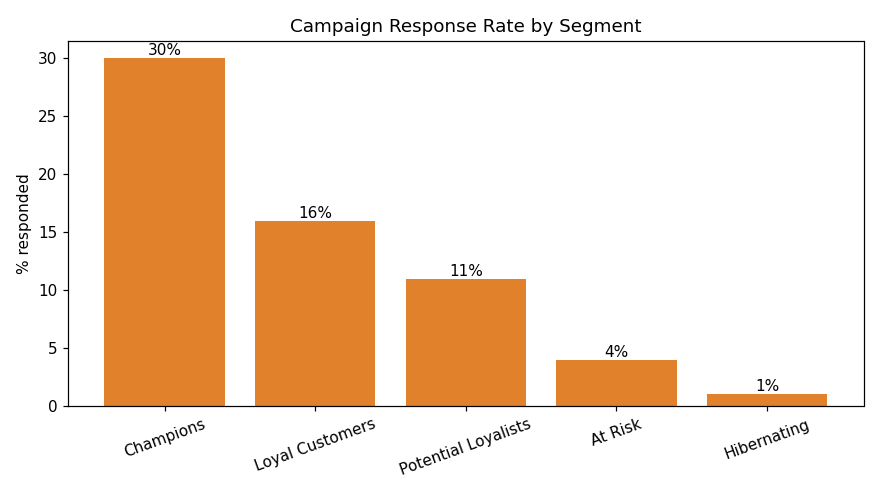
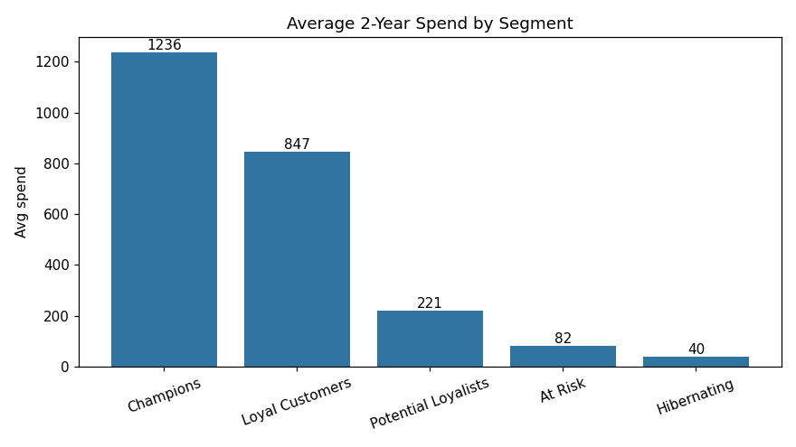
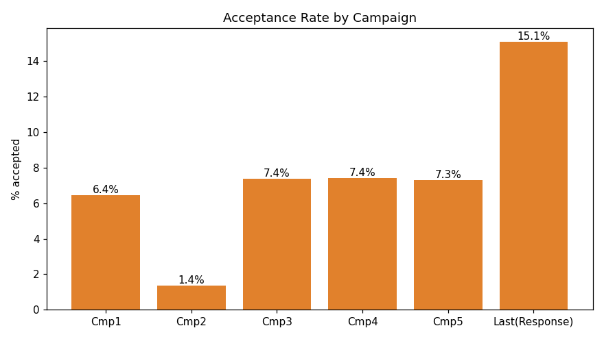
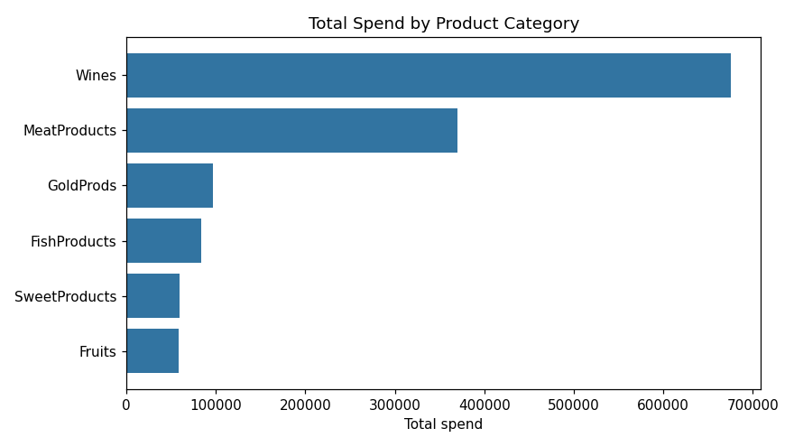
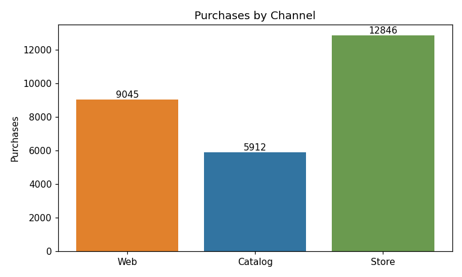

# Customer Segmentation & Campaign Targeting — Final Report

**Analyst:** Elyas Zulqarnain
**Question:** How do we segment customers so marketing can target the right people and
lift campaign response?
**Tool:** Power BI (cleaning, RFM segmentation, and all visuals)
**Data:** Marketing campaign dataset — 2,240 customers

---

## 1. Business task
The company runs marketing campaigns, but only about **15%** of customers respond, so most
of the budget reaches people who were never going to buy. Rather than blasting everyone,
the marketing team wants to **segment customers and focus spend on those most likely to
convert** — and understand what the best customers look like.

## 2. Data source
A public marketing dataset of **2,240 customers** (an iFood/superstore customer-analysis
case). Each row covers one customer: demographics, two years of spending by product
category, purchases by channel (web, catalog, store), and their responses to five past
campaigns plus the most recent one. No personal identifiers, so no privacy concerns.

## 3. Data cleaning & transformation (done in Power BI)
Full steps are in `Documentation/Process_Documentation.md`. In short: dropped two constant
columns, fixed Income (removed a 666,666 typo, filled 24 blanks with the median), removed
three impossible ages, tidied marital status, and engineered **Monetary** (total spend),
**Frequency** (total purchases), and family size. Non-buyers were removed. **Final: 2,207
customers.**

Each customer was then scored with **RFM** — Recency, Frequency, Monetary — on a 1&ndash;4
scale, and grouped into five segments.

## 4. Analysis summary
| Segment | Customers | Share | Avg spend (2yr) | Response rate |
|---|---|---|---|---|
| Champions | 533 | 24.2% | ~1,236 | **30%** |
| Loyal Customers | 632 | 28.6% | ~847 | 16% |
| Potential Loyalists | 498 | 22.6% | ~221 | 11% |
| At Risk | 420 | 19.0% | ~82 | 4% |
| Hibernating | 124 | 5.6% | ~40 | 1% |

The pattern is striking and clean: **response rate falls almost perfectly in line with RFM
strength** — from 30% for Champions down to 1% for Hibernating customers.

## 5. Key findings & visualizations
Charts are in `Final_Output/Charts`.

**Finding 1 — A small group of customers drives almost all the response.**

Champions (24% of customers) respond at **30%** — about 30x the Hibernating group. Targeting
Champions + Loyal Customers reaches ~53% of the base but captures the large majority of
likely responders.

**Finding 2 — Best customers spend far more.**

Champions spend ~1,236 over two years vs ~40 for Hibernating — the top segment is worth
roughly **30x** the bottom one.

**Finding 3 — One past campaign clearly failed.**

Campaign 2 was accepted by only **1.4%** of customers, versus ~6&ndash;7% for the others and
~15% for the latest campaign — a useful lesson in what *not* to repeat.

**Finding 4 — Wine and meat dominate spending; the store is the top channel.**

Wine (~675k) and meat (~369k) make up most spend, and the physical **store** drives the most
purchases, ahead of web and catalog.

## 6. Top 3 recommendations
1. **Concentrate campaign budget on Champions and Loyal Customers.** They're ~53% of
   customers but the overwhelming majority of responders. A smaller, targeted send should
   beat the current 15% blanket response rate at lower cost.
2. **Win back "At Risk" customers with a specific offer.** They were once frequent buyers
   (that's why they scored on F/M) but haven't purchased recently. A reactivation email or
   discount is worth testing on this 420-customer group.
3. **Lead with wine/meat and retire the Campaign-2 style.** Promote the categories customers
   already love, and don't repeat whatever Campaign 2 did — copy the format of the latest,
   higher-performing campaign instead.

### Next steps
- Recalculate RFM thresholds on fresh data and refresh monthly.
- A/B test the targeted-vs-blanket send to confirm the budget saving.
- Bring in campaign cost to turn response rate into ROI.

*Prepared as portfolio project #2 (Digital Marketing). Built end-to-end in Power BI.*
